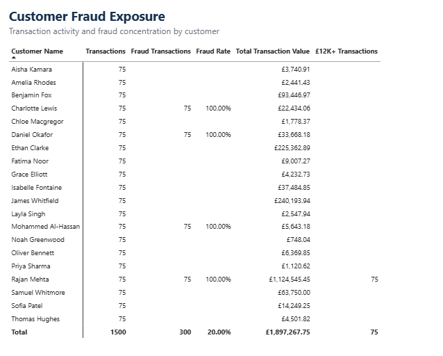
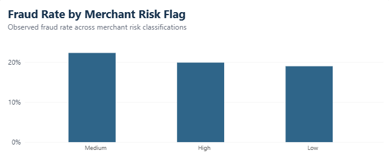
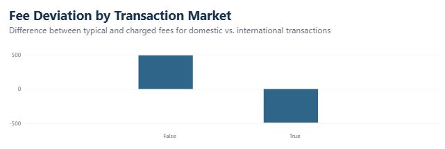
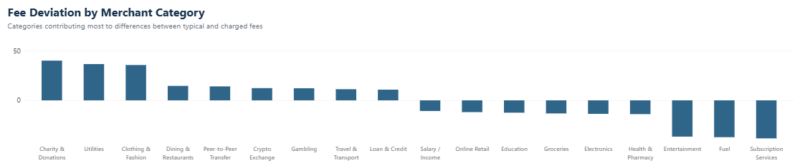
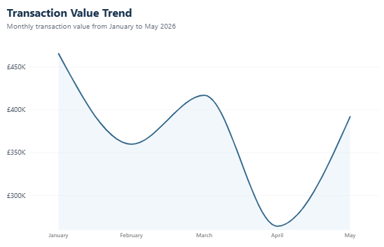
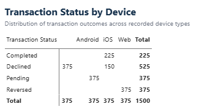
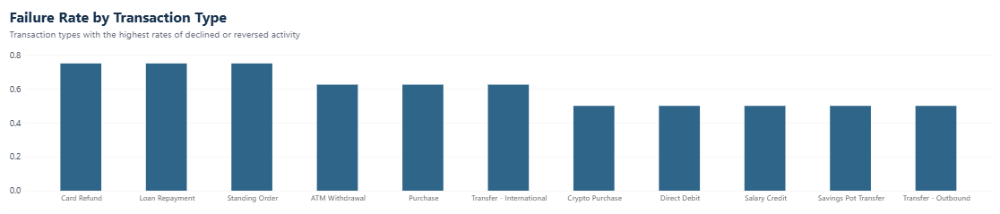

# Detailed Analysis

## Scope

This analysis examines **1,500 Zephyr Bank transactions from January through May 2026** to identify patterns in fraud exposure, fee performance, transaction reliability, and compliance risk. Analysis was conducted across customer, merchant, transaction, device, channel, geographic, and time-based dimensions to identify concentrations, compare performance across customer segments, and distinguish meaningful findings from patterns that may reflect the structure of the supplied dataset.

The analysis addresses the challenge's guiding questions while extending beyond them where exploratory analysis identified more significant business patterns.

---

## 1. Risk & Fraud Exposure

### Customer Segment Analysis

Customer behavior varies meaningfully across Zephyr Bank's four customer segments—**Starter, Standard, Premium, and Business**. The most significant differences appear in transaction value, fraud exposure, and fee generation.

| Customer Segment | Statistical Summary |
| --- | --- |
| **Starter** | Generates approximately **£0.50 in fee revenue per transaction**. No fraud-flagged transactions were observed for Starter customers. |
| **Standard** | Has the **highest transaction volume with 450 transactions**. Observed fraud rate is approximately **17%**, while fee revenue averages approximately **£0.17 per transaction**, the lowest of the four segments. |
| **Premium** | Accounts for **375 transactions** but generates substantially more transaction value than any other segment. Average transaction value is approximately **£3.2K**, compared with less than £1K for the other segments. Premium has the highest observed segment fraud rate at approximately **40%** and generates approximately **£0.50 in fee revenue per transaction**. |
| **Business** | Generates approximately **£1.00 in fee revenue per transaction**, the highest of the four segments. Observed fraud rate is approximately **25%**. |

The segment-level statistics initially suggest distinct customer profiles: Standard drives the greatest transaction volume, Premium drives transaction value and has the highest observed fraud rate, while Business produces the greatest fee revenue per transaction.

However, deeper customer-level analysis materially changes the interpretation of these segment results. Every transaction in the distinct **£12K+ group belongs to a single Premium customer, Rajan Mehta**, which accounts for much of Premium's unusually high transaction value. More broadly, all 300 fraud flags in the entire dataset originate from only four customers. Segment-level fraud rates therefore describe where those customers fall within the customer population rather than demonstrating that the segments themselves are inherently higher risk.

This distinction is important when interpreting the remaining analysis: **segment-level statistics identify where differences appear, while customer-level investigation helps determine what is actually driving them.**

### Fraud exposure is concentrated among four customers

Fraud flags account for **20% of all transactions**, with 300 of 1,500 transactions flagged as potentially fraudulent. However, this exposure is not broadly distributed across the customer base.

All 300 fraud-flagged transactions belong to four customers: **Charlotte Lewis, Daniel Okafor, Mohammed Al-Hassan, and Rajan Mehta**. Each customer has 75 transactions, and every transaction associated with these four customers is fraud flagged, producing a **100% observed fraud rate** for each. The remaining 16 customers also have 75 transactions each but have no fraud-flagged transactions. As a result, **20% of customers account for 100% of fraud flags**.

This customer-level concentration is substantially stronger than differences observed across merchant categories, devices, or customer segments. Merchant categories initially appeared to separate into higher- and lower-fraud groups, but deeper analysis found highly structured interactions between merchant category and customer segment.

*Figure 1. Fraud flags are fully concentrated among four customers, each with a 100% observed fraud rate.*

#### Guiding Question: Which transaction represents the highest risk-adjusted exposure?

The supplied criteria do **not identify a unique transaction**. Among transactions that are both fraud flagged and Declined, seven transactions tie for the highest transaction amount at **£518.18**. Selecting any one of the seven would therefore be arbitrary.

Customer-level analysis provides a more meaningful prioritization. The four customers responsible for all fraud flags represent the clearest concentration of observed fraud exposure and should be prioritized for investigation.

### Large-value activity creates additional exposure for one customer

Transaction amounts contain a distinct upper-value group beginning at approximately **£12,000**, following a gap from transactions of approximately £3,000 and below. Every transaction in this £12K+ group belongs to **Rajan Mehta**, and all of his transactions are fraud flagged.

This concentration also explains much of the apparent segment-level transaction value difference. Premium customers average approximately **£3.2K per transaction**, compared with less than £1K for every other customer segment. Standard customers actually generate more transactions than Premium customers, demonstrating that Premium's higher total value is driven by transaction size rather than greater transaction volume. Rajan Mehta's activity accounts for every transaction in the £12K+ group.

### Merchant risk classifications do not strongly differentiate observed fraud

Merchant-category risk classifications show relatively little separation in observed fraud rates:

- **Medium:** 22.30%
- **High:** 19.88%
- **Low:** 18.97%

Medium-risk categories have the highest observed fraud rate, while categories classified as High risk do not show substantially more fraud than those classified as Low risk. The higher- and lower-fraud merchant-category clusters identified during exploratory analysis also contain categories from multiple risk classifications.

*Figure 2. Observed fraud rates remain similar across the three merchant risk classifications.*

The result does not establish that Zephyr's risk classifications are incorrect. The definition and intended use of `risk_flag` are not provided, and a fraud flag represents potential rather than confirmed fraud. Instead, the evidence indicates that **merchant risk classification alone would not effectively prioritize the fraud exposure observed in this dataset**.

### KYC status does not identify the observed fraud concentration

All fraud-flagged transactions belong to **KYC-verified customers**; no fraud flags were observed among non-KYC customers. KYC-verified customers also have an approximately **37.5% decline rate**, compared with approximately **25% among non-KYC customers**.

The observed data therefore does not show elevated fraud or decline activity among non-KYC customers.

This should not be interpreted as evidence that KYC verification increases risk or that non-KYC customers are inherently lower risk. It demonstrates only that **KYC status does not explain the observed concentration in this sample**.

---

## 2. Fee & Revenue Analysis

### Fee revenue remains relatively stable despite changes in transaction activity

Zephyr Bank generated **£750.17 in total fee revenue** during the five-month analysis period.

Monthly fee revenue remained relatively stable at approximately **£134–£163**, despite larger fluctuations in transaction activity. Fee revenue per transaction ranged from approximately £0.47 to £0.54. April generated the highest fee revenue per transaction at approximately **£0.54 despite having the lowest transaction volume**, while May processed substantially more transactions but generated similar total fee revenue.

A simple continuation of the January–May average monthly fee revenue produces an H2 run-rate of approximately **£900.20**. This is a run-rate projection rather than a statistical forecast and assumes that observed transaction volume, mix, pricing behavior, and fee rules remain broadly consistent.

### Domestic and international transactions show opposing fee patterns

Comparison of actual fees with `typical_fee_gbp` identified a highly structured difference between domestic and international transactions.

International transactions were charged a net **£487.11 below typical fees**. Domestic transactions show the opposite pattern, with actual charges a net **£487.00 above typical fees**. In both groups, these totals are produced by numerous relatively small transaction-level differences rather than isolated extreme transactions.

*Figure 3. Domestic and international transactions show nearly equal but opposing net deviations from typical fees.*

#### Guiding Question: Where is potential fee leakage occurring?

The strongest potential signal is among **international transactions**, where actual charges fall £487.11 below typical fees in aggregate. However, this amount should **not be classified as confirmed lost revenue**.

The dataset describes `typical_fee_gbp` as a typical fee rather than a mandatory fee. Pricing rules, waivers, customer-specific arrangements, and other legitimate fee adjustments are not provided. The analysis can therefore identify where actual charges differ from typical pricing, but additional business-rule data is required before determining whether any portion represents recoverable revenue.

Merchant-category analysis provides additional targeting. **Charity & Donations, Utilities, and Clothing & Fashion** have the largest net below-typical fee deviations. **Entertainment, Fuel, and Subscription Services** have the largest net above-typical deviations.

*Figure 4. Fee deviations are concentrated in specific merchant categories rather than distributed uniformly.*

### Business customers generate the greatest fee revenue per transaction

Business customers generate approximately **£1.00 in fee revenue per transaction**, the highest of any customer segment. This indicates that Business customers' greater total fee contribution is not simply a consequence of transaction volume.

Account tenure initially appeared to have a relationship with fee performance: customers with 6+ years of tenure generated approximately £0.78 per transaction. However, all Business customers fall within this tenure group. Excluding Business customers reduces the 6+ year cohort to approximately £0.50 per transaction, similar to the 2–3 year cohort. **Customer segment composition therefore appears to explain more of the observed fee difference than tenure itself.**

### April's lower transaction value reflects both volume and transaction mix

Total transaction value was highest in January at approximately **£465K** and fell to approximately **£265K in April**, before rebounding in May. April also had the lowest transaction count, but volume alone does not explain the difference: February and April had similar transaction counts while April generated substantially less transaction value.

The mix of large-value transactions provides additional context. Approximately **seven £12K+ transactions** occurred in April, compared with roughly 15–20 in each of the other months. The reduction in these large transactions likely contributed to April's lower total transaction value.

*Figure 5. Transaction value reached its lowest point in April before rebounding in May.*

---

## 3. Product & Transaction Reliability

Across the portfolio, only **225 of 1,500 transactions (15%) reached Completed status**, while **900 transactions (60%) were Declined or Reversed** under the analysis's failure definition. The remaining 375 transactions were Pending. This unusually low completion rate makes transaction reliability a significant issue in the supplied dataset, but deeper analysis shows that transaction outcomes are highly structured by device type.

### Transaction outcomes are unusually concentrated by device type

Each device group contains exactly **375 transactions**, yet outcomes differ almost completely:

| Device | Observed Transaction Outcome |
| --- | --- |
| **Android** | 375 Pending |
| **Web** | 375 Reversed |
| **Blank** | 375 Declined |
| **iOS** | 225 Completed; 150 Declined |

As a result, Web and blank-device transactions have 100% failure rates under the Declined + Reversed definition, while iOS has a 40% failure rate. Android has no transactions classified as failed because all 375 remain Pending.

*Figure 6. Transaction status shows an unusually deterministic relationship with recorded device type.*

This relationship should **not be interpreted as evidence that device type causes transaction failure**. The equal device volumes and deterministic status patterns are unusual enough to require validation before using them to make product or UX decisions.

#### Data Quality Finding

The device field also contains **375 blank values**, despite the supplied data dictionary documenting expected values of iOS, Android, Web, and N/A. Blank values occur across multiple transaction types and cannot safely be assumed to represent the documented N/A category. They were therefore retained as unknown during analysis.

The combination of undocumented blanks and deterministic device/status behavior increases the importance of validating device capture, status mapping, and upstream processing before drawing product conclusions.

### Failure rates vary by transaction type

Failure was defined as a transaction ending in either **Declined or Reversed** status.

Card Refund, Loan Repayment, and Standing Order have the highest failure rates at **75%**. Each transaction type contains 100 transactions: 50 Declined, 25 Reversed, 25 Pending, and no Completed transactions.

ATM Withdrawal, Purchase, and International Transfer have the next-highest rates at approximately **62.5%**. Even transaction types with lower failure rates are approximately 50%, indicating that unsuccessful outcomes are common throughout the dataset rather than isolated to a single transaction type.

*Figure 7. Card Refund, Loan Repayment, and Standing Order have the highest observed failure rates at 75%.*

#### Guiding Question: Which transaction types should be prioritized for UX improvement?

Based on observed failure rate, **Card Refund, Loan Repayment, and Standing Order** provide the clearest starting point for investigation because each reaches 75%.

However, the broader data-quality and processing patterns should be validated before attributing these failures to UX. Transaction type is useful for identifying where failures are concentrated, but the supplied data does not establish whether the underlying cause is user experience, processing logic, system behavior, or another operational factor.

### Channel does not clearly explain high failure activity

Failure rates are comparatively similar across channels, ranging from approximately **58% to 63%**. ATM Network and Automated have the highest rates at approximately 62–63%, while Mobile App and Web Browser are approximately 58%.

Mobile App generates the highest absolute number of failed transactions, but this reflects greater transaction volume rather than a substantially elevated failure rate.

The narrow spread across channels means there is **no individual channel that clearly explains the high failure activity**. Channel therefore provides a weaker basis for prioritization than transaction type, and the device/status relationship should be validated before channel-specific UX changes are recommended.

---

## 4. Additional Patterns Investigated

Not every pattern identified during exploratory analysis warranted inclusion as a primary dashboard finding. Several analyses were retained as supporting context because they help distinguish stronger signals from weaker or potentially misleading ones.

### Time-based patterns do not identify a sustained risk period

Fraud and decline rates fluctuate from week to week, but neither shows a sustained period of unusually elevated activity. Fraud rates range from roughly **9% to 30%**, with peaks and troughs distributed throughout the five-month period rather than concentrated in one continuous interval.

High-risk merchant-category activity is more common Sunday through Tuesday and reaches its lowest level on Thursday. However, fraud, declines, and high-risk merchant activity exhibit different day-of-week and time-of-day patterns. No common temporal window emerged that would explain all three measures.

### Geographic fraud patterns are primarily customer-driven

London generates the greatest transaction volume and substantially more transaction value than any other region. Fraud flags occur only in London and the Midlands, with approximately **225 fraud-flagged transactions in London and 75 in the Midlands**.

However, because all fraud flags originate from only four customers—and Rajan Mehta's large-value transactions materially increase London's transaction value—the geographic pattern is better interpreted as a consequence of **customer-level concentration** than evidence of broad geographic risk.

ATM reversals and international declines also show some geographic concentration. ATM reversals occur only in South East and Wales, while international declines occur only in London, Scotland, and South East. South East is the only region represented in both groups. The overlap may warrant operational review, but the available evidence does not establish a common underlying cause.

### International transactions show higher value and fraud rates

International transactions have an average transaction value of approximately **£1.45K**, compared with approximately **£1.2K for domestic transactions**. Their observed fraud rate is also higher at approximately **25%**, compared with approximately 18–19% for domestic transactions.

Failure rates, however, are similar—approximately 58% international versus 60% domestic. International activity therefore differs more clearly in transaction value, fraud exposure, and fee behavior than in operational failure rate.

This also reinforces the need to investigate the international fee pattern: the same group that carries higher average value and observed fraud rates also shows substantial aggregate below-typical fee charges.

---

## 5. Analysis Limitations

Several characteristics of the supplied dataset require caution when interpreting the results.

A fraud flag indicates **potential fraud rather than confirmed fraud**, and no benchmark is provided for Zephyr Bank's expected or acceptable fraud-flag rate. Similarly, `typical_fee_gbp` provides a reference fee but does not establish the mandatory fee for an individual transaction. The analysis therefore identifies pricing deviations rather than confirmed fee leakage or overcharging.

The dataset also contains several unusually uniform patterns. Every customer has exactly 75 transactions, each device group contains exactly 375 transactions, and transaction status is nearly deterministic by device. These characteristics suggest that some relationships may reflect the structure of the supplied challenge data rather than naturally occurring banking behavior.

Finally, undocumented blank `device_type` values prevent reliable interpretation of those records as the N/A category described in the data dictionary.

For these reasons, findings that indicate strong associations—particularly device/status behavior, customer fraud concentration, and fee deviations—should be treated as **signals for validation and investigation rather than evidence of causation**.